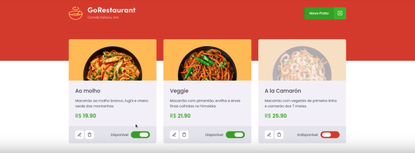

# Desafios Ignite React 

Repositório destinado a armazenar todas as resoluções dos desafios que desenvolvi no ignite da Rocketseat.

 

&nbsp;

## Desafio 01 - Componentizando a Aplicação

Durante este desafio, utilizamos os conceitos de tipagem no React, refatorando uma página para listagem de filmes de acordo com gênero. 

 

&nbsp;

## Desafio 02 - Refatorando Classes

Durante este desafio, utilizamos uma aplicação já funcional, cujo o principal objetivo foi realizar realizar dois processos de migração: de Javascript para Typescript e de Class Components para Function Components.

 

&nbsp;

## Desafio 03 - Hook Carrinho de Compras

Durante este desafio desenvolvemos um carrinho de compras, adicionando um novo produto ao carrinho, removendo um produto do carrinho, Alterando a quantidade de um produto no carrinho, calculando os preços sub-total e total do carrinho, validando o estoque e exibindo mensagens de erro.

 

&nbsp;

Feito com 💙 por Caique Prado

